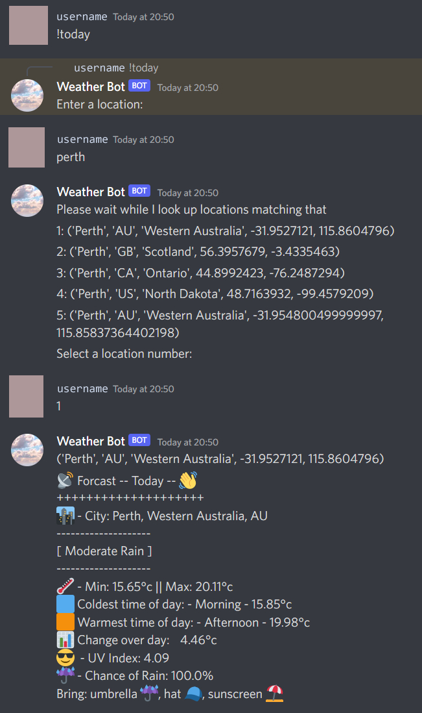

# Weather Discord Bot 
Version 1.0

### Short description
A bot that takes a users input, prints options for possible locations, and then returns the weather based on Open Weather Map API response. 

## Commands
Prints todays weather forcast for a location
```
!today
```
Prints tomorrows weather forcast for a location
```
!tomorrow
```
## Logic
If chance of rain > 60% it will recommend an `umbrella`
If UV index is over 3 it will recommend `hat`. `sunscreen`

## Resources Used
* [Open Weather Map API](https://openweathermap.org/api) - Weather data
* [discord.py](https://discordpy.readthedocs.io/en/stable/) - Discord library for python

### Usage example



## Build Notes
Currently hosted locally / in IDE so not always online. 

API supports lots of features for future expansion. 

First attempt at using discord.py.

### Improvements
⭕ Add unit tests

⭕ Reformat location choice selection into a reusable function. Current issue with api response taking too long then raising an exception for the next command.

⭕ Reformat commands from message.startswith to @bot.commands

⭕ Check if there are any forks needed for discord.py to keep working

⭕ Reformat emojis to be general unicode rather than discord specific emoji names for better compatibility

⭕ Create docker image for bot

⭕ Find hosting for the bot

## Future Features
✅ Up to 7 days forcasts (supported in the api & handler I wrote for api data, just not as a command yet)

✅ Checking for wind speed / gusts and recommending a windbreaker

✅ Recommending to stay inside in extreme weather (Thunderstorm, Snow, Extreme Heat)

✅ Emoji's for the description field e.g [Light clouds 🌤️]

✅ Pollution / Smoke forcast feature

✅ Options for text output (short, regular, long)

✅ Port to a slack bot

